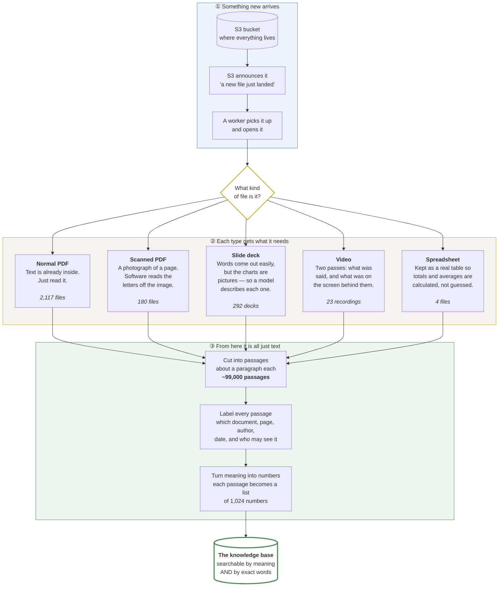
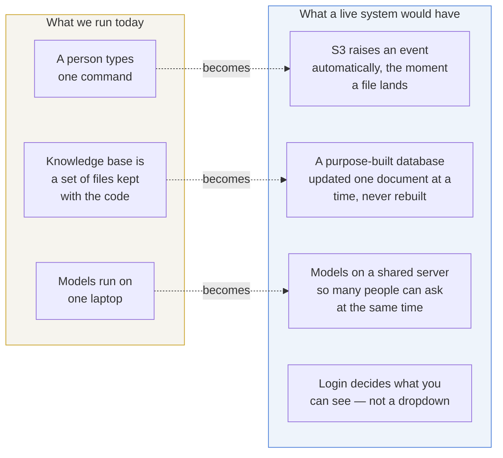
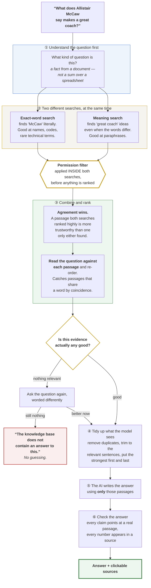
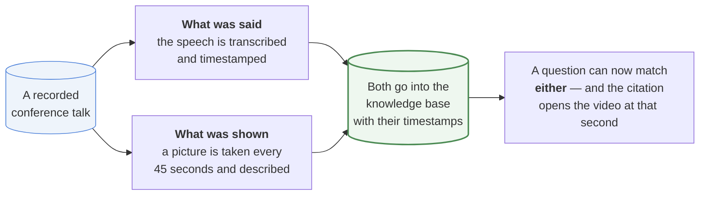

# TennisExplore — how it works

Written for a non-technical reader. No code, no jargon that isn't explained.

> **Viewing these diagrams:** they render automatically on GitHub. In VS Code,
> install the "Markdown Preview Mermaid Support" extension and press
> `Ctrl+Shift+V`. Or paste any block into <https://mermaid.live> to get an
> image for a slide deck.

---

## The one-sentence version

Tennis Australia has thousands of documents, presentations and recordings that
nobody can search properly. This turns all of it — including the things that
aren't text, like scanned pages, charts and video — into something you can ask
a question of in plain English, and get an answer that tells you exactly which
document, page or moment it came from.

---

## Part 1 — When new material arrives

### Why "turn meaning into numbers" matters

A computer can't tell that *"stopping kids hurting their backs"* and *"lumbar
bone stress injury prevention"* are the same topic — they share no words.

So every passage is converted into a list of 1,024 numbers that represents its
**meaning**. Passages about similar things end up with similar numbers, even
when the words are completely different. That's what makes it possible to find
the right paper without knowing the exact phrase the researcher used.

---

## Part 2 — What a production system would add

We built the thinking. A live deployment changes the plumbing around it.

**What stays exactly the same:** how files are sorted by type, how they're cut
up and labelled, how access is enforced, how searches are combined and ranked,
and how answers are checked against their sources.

That's deliberate. The expensive thing to get right is the *judgement* — what to
retrieve, how to rank it, when to refuse. Swapping files for a database is a
week's work against a settled design.

**The honest summary: the thinking is production-shaped. The plumbing isn't.**

### Concretely, the pieces they'd need

| Piece | What it does | Why |
|---|---|---|
| **S3** | Holds the original files | Already have it |
| **Event + queue** | Notices new files, queues the work | So nobody has to remember to press a button |
| **Workers** | Do the converting and labelling | Can run many at once when a batch arrives |
| **Vector database** | Holds the searchable passages | Updated one document at a time instead of rebuilt |
| **Model server** | Runs the AI models | One laptop can serve one person; a server serves everyone |
| **Login (SSO)** | Decides who sees what | Today it's a dropdown. That's fine for a demo and unacceptable in production — anyone can pick "Admin" |
| **Records database** | Which files exist, processing status, usage logs | Already built |

---

## Part 3 — When someone asks a question

Following one real question all the way through.

---

## Part 4 — The same question, with the real sources it finds

This is a genuine result from the indexed material.

> **Question:** *"What does Allistair McCaw say makes a great coach?"*

**What the exact-word search finds** — it latches onto the name "McCaw":

| | |
|---|---|
| McCaw's recorded talk, spoken words, **0:02–1:27** | *"…my presentation on the four key areas I believe every coach…"* |
| McCaw's talk, **a slide on screen at 1:30** | *"A great coach isn't determined by the level of player they coach. A great coach is determined by…"* |

**What the meaning search finds** — it doesn't need the name at all, it matches
the *idea* of coaching quality:

| | |
|---|---|
| A coaching-conference recording by a different speaker | on coaching delivery and communication |
| A research PDF | on coach emotional intelligence |

**How they're combined:** the two passages from McCaw's own talk were found by
**both** searches, so they rise to the top. Two different methods, working in
completely different ways, independently agreeing — that's a much stronger
signal than either score on its own.

**What gets checked before answering:** does the evidence actually mention
"McCaw"? Yes. If a question named a person or a year the archive had never
heard of, it would stop here and say so rather than writing something
plausible.

**What the answer looks like:** a short paragraph, with `[1]` `[2]` markers, and
buttons underneath. Clicking one opens the recording **at 1:30** — the exact
moment that slide was on screen — beside the conversation, without losing your
place.

---

## Part 5 — Video, because it's the unusual part

Most search tools ignore video entirely. This one reads it two ways.

**Why both.** A speaker says *"as you can see here"* and everything that matters
is in the picture. Transcribing only the audio would lose it.

From the 23 recordings:

| | |
|---|---|
| Passages from speech | 438 |
| Passages from what was on screen | **626** |
| Total | 1,064 |

The on-screen pass found *more* than the speech did.

---

## The three things worth remembering

**1. Every answer is traceable.** Not "somewhere in the research" — a document,
a page, a slide, or a second of video, that opens in one click. An answer that
can't be checked isn't worth much.

**2. It refuses.** If the archive doesn't contain the answer, it says so instead
of writing something that sounds right. That is the hardest part to build and
the easiest to skip, and it's what separates a tool a coach can trust from one
they can't.

**3. It respects who you are.** A performance analyst and a physiotherapist ask
the same question and get different results, because the permission filter runs
*inside* the search rather than tidying up afterwards. Athlete medical data
never enters a search that shouldn't see it.
