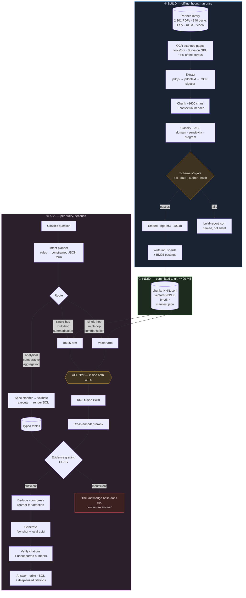
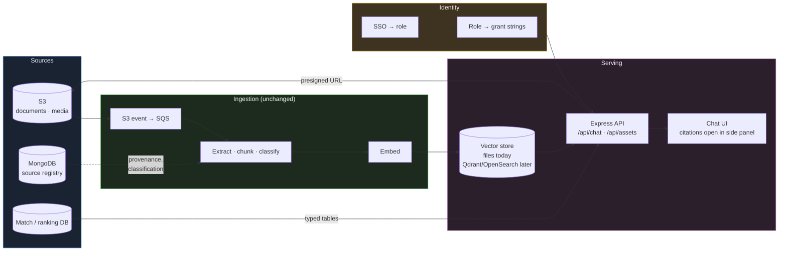

# Architecture

Three separable systems. Understanding where the boundaries are matters more
than any single component, because it is what lets the slow parts run once,
offline, on one machine — and everyone else just query the result.

## Why the boundaries sit there

**① Build is the only slow part** — hours of GPU time. It runs once, on the
machine that has the source files, and it checkpoints so an interruption costs
minutes rather than the whole run.

**② The index is a build artefact, and it is committed.** That is the decision
everything else follows from. Int8 quantisation makes it ~400 MB instead of
1.5 GB and shards keep every file under GitHub's 100 MB limit, so a teammate
runs `git pull` and has the *identical* index — not their own rebuild of it.
Without this, nobody is comparing the same thing.

**③ Ask needs no source files and no GPU-hours** — just Ollama and the index.

## The two gates

Both are marked amber above, and both **fail closed**.

**The schema gate** rejects any chunk missing `acl_groups`, `event_date`,
`authors` or `content_hash`. These have to exist before embedding: adding an
indexed field afterwards means re-embedding the entire corpus.

**The ACL filter** runs *inside* both retrieval arms, before either produces a
ranked list — never as a post-filter. A post-filter lets a forbidden chunk take
one of the k slots and then get dropped, silently shortening the result set.
`assertAccessInvariant` re-checks after fusion and throws; it should never fire,
and it exists so a refactor that drops the filter fails loudly instead of
returning a fluent answer built on data the caller cannot see.

---

## With real connectors

Today the corpus is a folder. In production it is S3, and the shape barely
changes — which was the point of keeping extraction behind one interface.

**What changes:** `listIngestableFiles` walks an S3 bucket instead of a folder.
`/api/assets/:docId` returns a presigned S3 URL instead of a local file. The
role comes off an SSO session instead of a query parameter — and that one is not
optional, because a caller who picks their own role has every role.

**What does not change:** chunking, classification, the schema gate, ACL
enforcement, fusion, grading, generation, verification. All of it is already
written against interfaces rather than against the filesystem.

**The one thing worth revisiting at that point** is the vector store. Brute-force
int8 over 128k chunks is ~145 ms, which is fine. Past a few million it will not
be, and that is when an ANN index earns its recall cliff and its build time.

---

## Generation layer

Every technique here is training-free — prompt and pipeline changes only.

| Stage | What it does | Why |
|---|---|---|
| **Evidence grading** (CRAG) | Judges each passage's relevance before generating; refuses if nothing is relevant | Retrieval *always* returns something. Ten irrelevant passages produce a confident wrong answer, because from the model's seat ten real passages look like grounds to answer |
| **Deduplication** | Drops near-identical passages, records what was absorbed | The corpus holds the same deck 3–4 times. **Measured: 4.2% of chunks are duplicates.** Without this the model reads one paragraph four times and it looks like four corroborating sources |
| **Compression** | Removes sentences in a chunk unrelated to the question | A 1600-char chunk earns its place on 2–3 sentences. On an 8B model this is the difference between fitting twelve passages and six |
| **Attention ordering** | Strongest evidence first *and* last, weakest in the middle | Models demonstrably lose material in the middle of a long context |
| **Few-shot exemplars** | 1–2 worked examples per intent, including refusals | Describing "cite every claim" gets ~half. *Showing* it gets near-perfect. And a model that has never seen a refusal will not produce one |
| **Verification** | Checks citations resolve and numbers appear in a source | The prompt *asks* for grounding. This checks whether it happened — different things, and only the second is evidence |

Verification is deliberately mechanical rather than a second model call. A model
judging another model shares its failure modes and mostly rubber-stamps; string
checks are cruder but independent, which is the property that matters.
