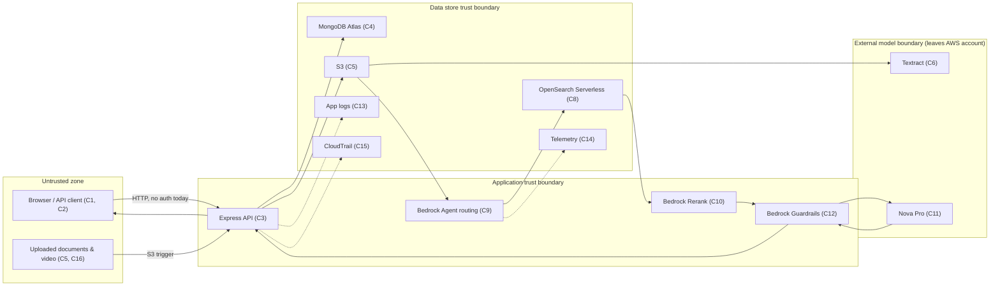

# TennisExplore V2 — Data Threat Model & Data Classification Controls

**Ticket:** TENISE-43 / E5-20
**Epic:** Epic 5 — Security, Privacy & Governance
**Status:** Draft v0.1 — under active development

## 1. Purpose

Identify how data moves through TennisExplore, what security and privacy
threats exist at each stage, and which controls are required, so that the
demonstration never exposes sensitive information or relies on undocumented
security assumptions, and so stakeholders are shown a security model that
scales to a production solution.

## 2. Scope

Per the acceptance criteria this covers: S3 storage, ingestion, document
processing, OpenSearch, Bedrock requests, the chat interface, temporary
files and application logs.

Two layers exist side by side in this repository today and both are in
scope, because threats introduced now (Sprint 1) do not wait for the rest
of the pipeline to be built:

| Layer | State | Source |
|---|---|---|
| Source Registry API (Express + MongoDB Atlas) | **Implemented** (this repo, `src/modules/sources`) | Current code |
| Ingestion → OpenSearch → Bedrock Agents → Nova Pro → Guardrails pipeline | **Planned** (Epics 2–5) | Jira TENISE-2, TENISE-3, TENISE-4, TENISE-5 |

The initial corpus must contain only synthetic, public, anonymised or
otherwise approved information — see [§7 Data Gate](#7-data-gate-hard-constraint).

## 3. System Inventory & Trust Boundaries

### 3.1 Components

| # | Component | Type | State | Notes |
|---|---|---|---|---|
| C1 | Chat interface (browser client) | Client | Planned (TENISE-7) | Untrusted input origin |
| C2 | Admin/API client (curl, Postman, future UI) | Client | Implemented | Currently **no authentication** on any route |
| C3 | Express API (`src/app.js`, `modules/sources`) | Application | Implemented | Public CORS (`cors()` with no origin allow-list) |
| C4 | MongoDB Atlas (`tennis_explore_v2`) | Data store | Implemented | External managed service, holds source registry metadata |
| C5 | S3 bucket (raw uploads) | Data store | Planned (TENISE-11) | Trigger for ingestion pipeline |
| C6 | Amazon Textract | External service | Planned (TENISE-12) | Receives scanned document images/PDFs |
| C7 | Amazon Bedrock Knowledge Bases (chunking) | Processing | Planned (TENISE-13/E2-07) | Reads from S3, writes to OpenSearch |
| C8 | OpenSearch Serverless (NextGen collection) | Data store (vector + keyword index) | Planned (TENISE-15) | Must carry the ACL field from first write (blocks E5-17) |
| C9 | Bedrock Agents (routing) | Processing | Planned (TENISE-3) | Decides statistics vs. document route |
| C10 | Bedrock Rerank | Processing | Planned (E3-12) | Reorders retrieved evidence |
| C11 | Amazon Nova Pro (generation, incl. video frames) | External model | Planned (Epic 4) | Receives retrieved evidence + prompt; video frames sent directly |
| C12 | Bedrock Guardrails | Control plane | Planned (E5-18) | Content safety + contextual grounding (refusal on insufficient evidence) |
| C13 | Application logs / console output | Data store | Implemented | `errorHandler.js` does `console.error(error)` — full error object, unfiltered |
| C14 | Telemetry store | Data store | Planned (TENISE-26) | Per-stage records, must not duplicate raw content |
| C15 | AWS CloudTrail | Audit | Planned (E5-19) | Who accessed which document, when |
| C16 | Temporary files (multer upload buffer/disk) | Data store (transient) | Wired but unused (`upload.middleware.js` present, no route mounts it yet) | Needs explicit cleanup policy once wired |
| C17 | `.env` / environment configuration | Secrets | Implemented | Holds `MONGODB_URI` with embedded DB credentials; gitignored |

### 3.2 Trust boundaries

**Key boundary crossings that matter for threats:**

1. **Client → API (T1 boundary):** currently unauthenticated — anyone who
   can reach the port can read, create or archive sources.
2. **API/Agent → external model (Textract, Nova Pro):** document content
   and video frames leave the AWS account trust boundary and reach an
   external managed model endpoint. Prompt injection embedded in an
   uploaded document crosses this boundary as instructions, not just data.
3. **OpenSearch → Agent/Rerank:** this is the pre-retrieval access-control
   enforcement point required by Epic 5 — filtering here is real access
   control, filtering in the UI afterward is not, because the content has
   already reached the model by then.
4. **API/Agent → Logs/Telemetry:** anything logged here persists outside
   the data classification the source was assigned (e.g. a sensitive
   query string ending up in a plaintext log).

## 4. Data Classification Scheme

| Tier | Definition | Criteria | Examples in this system |
|---|---|---|---|
| **Public** | Freely shareable, already public before entering the system | No restriction on redistribution; no attribution to an identifiable individual required | Published ranking data, public conference talks, research papers |
| **Internal** | Not secret, but not meant for external distribution | Produced or held by the team for internal coaching/demo use; disclosure would cause minor embarrassment or confusion, not harm | Internal coaching notes, draft match reports, demo corpus manifests |
| **Sensitive** | Disclosure could cause reputational, competitive or contractual harm | Tied to a specific team/organisation's competitive advantage, or covered by a data-sharing agreement | Unpublished scouting reports, coach interview transcripts, opponent analysis |
| **Personal** | Identifies or can reasonably identify a natural person | Contains name, contact detail, or another identifier that is linkable to one individual, per privacy-law definitions of PII | Athlete names tied to performance stats, player contact info, session participant identity |
| **Biometric** | Derived from an individual's physical/behavioural characteristics | Data captured from body, motion or physiological signal, usable to identify or profile a specific person | Video frames showing an identifiable stroke sequence/face, any future motion-capture or physiological data |

Ordering is cumulative for risk purposes: `Public < Internal < Sensitive <
Personal < Biometric`. A document containing any Personal or Biometric
element is classified at that level even if the rest of the document is
Public.

### 4.1 Data inventory (current + planned) mapped to classification

| Data | Where it lives | Classification | Why |
|---|---|---|---|
| Source registry metadata (title, description, sourceType) | MongoDB (C4) | Internal | Team-authored catalog entries, no PII by design today |
| Uploaded research papers, ranking data (published) | S3 → OpenSearch (C5, C8) | Public | Already public before ingestion |
| Coach interviews, internal notes, scouting/match reports | S3 → OpenSearch (C5, C8) | Sensitive (may contain Personal) | Competitive value; may name athletes |
| Video clips with identifiable stroke sequences | S3 → Nova Pro (C5, C11) | Biometric | Directly identifies a person via motion/appearance |
| Chat queries and generated answers | API ↔ Bedrock Agent (C3, C9, C11) | Inherits the classification of the evidence cited | An answer citing a Sensitive source is itself Sensitive |
| Application error logs | Console / C13 | Currently unclassified — **gap** | `console.error(error)` may capture request bodies/stack traces containing any of the above |
| `.env` credentials (Mongo URI, future AWS keys) | Local `.env`, gitignored | Sensitive (secret) | Full database access if leaked |
| Telemetry records | C14 | Internal (must stay content-free) | Must record metadata (counts, latency) not raw content — see T-06 |

## 5. Threat Register

Risk = Likelihood × Impact, rated Low / Medium / High. Every **High**
risk carries a mandatory mitigation and is recorded as a **blocker** to
handling any real (non-synthetic) data, per §7.

| ID | Category | Threat | Affected component(s) | Likelihood | Impact | Risk | Mitigation | Owner | Status |
|---|---|---|---|---|---|---|---|---|---|
| T-01 | Unauthorised data access | No authentication/authorization exists on the API today — any client can read, create or archive any source | C2, C3 | High | High | **High** | Add authentication (session or token) and role-based access (coach vs. athlete, per Epic 5 scope) before any non-synthetic data is loaded; enforce at C3 and again at the OpenSearch pre-retrieval layer (E5-17), never only in the UI | E5-17 owner (TBD) | **Open — blocker** |
| T-02 | Cross-user data leakage | Retrieval returns chunks the requesting user's role should not see, because ACL filtering happens after retrieval instead of before | C8, C9 | Medium (until Epic 3/5 land) | High | **High** | ACL field must exist in the OpenSearch index schema from the first write (TENISE-15); Bedrock Agent action group must filter by role before evidence reaches Rerank/Nova Pro | E3-09 / E5-17 owners | **Open — blocker**, tracked as test in §6 |
| T-03 | Prompt injection via uploaded documents | Instructions embedded in an uploaded PDF/DOCX/transcript attempt to override system behaviour once ingested and later cited as evidence | C5, C6, C9, C11 | Medium | High | **High** | Treat all ingested content as data, never as instructions, in the prompt template (E4-16); Bedrock Guardrails contextual grounding (E5-18) as a second layer; explicit test case with an adversarial document | E4/E5 owners | **Open — blocker** |
| T-04 | Sensitive data in prompts/responses/logs | A Sensitive/Personal/Biometric source is quoted verbatim in a generated answer, or the request/response pair is written to logs or telemetry unredacted | C11, C13, C14 | Medium | High | **High** | Citation binding (E4-15) must reference chunk IDs, not force verbatim reproduction of Personal/Biometric content; telemetry (TENISE-26) stores counts/metadata only, never raw content; log statements must not dump full request/error bodies | Telemetry + logging owners | **Open — blocker** |
| T-05 | Credential exposure | Secrets (Mongo URI, future AWS keys) committed to git, printed to logs, or shared in chat/tickets in plaintext | C17, C13 | Medium | High | **High** | `.env` stays gitignored (already true); never echo full connection strings in logs or commit messages; rotate any credential that was pasted into a non-secret channel | Whole team | **Open — blocker** (see note below) |
| T-06 | Malicious or corrupt uploads | A corrupt or crafted file (e.g. the deliberately corrupt PDF in TENISE-34's test corpus, or a zip bomb / oversized file) disrupts ingestion or is used as an attack vector | C5, C6, C16 | Medium | Medium | Medium | Ingestion pipeline must isolate per-file failures (already an acceptance criterion of TENISE-11) and cap file size/type at upload; multer middleware (`upload.middleware.js`) needs size/type limits wired before it is mounted | TENISE-11 owner | Open |
| T-07 | Incomplete data deletion | Archiving a source (`archiveSource`) only sets `isActive: false` — the document and its underlying chunks/embeddings/log traces are not actually erased | C4, C8, C13, C14 | High (already true today) | Medium | Medium | Define and document a real deletion/retention path before real data is loaded: what "delete" means across Mongo, OpenSearch, S3, logs and telemetry | Data owner (TBD) | Open |
| T-08 | Unrestricted cross-origin access | `app.use(cors())` allows any origin with no allow-list, widening who can call the API from a browser context once C2 is not the only client | C3 | Low today (no auth yet makes this secondary), rises once auth exists | Medium | Low–Medium | Restrict CORS to known origins once a real frontend exists; revisit alongside T-01 | E5-17 owner | Open |

**Note on T-05:** a real MongoDB Atlas connection string (including
password) was shared in this chat session on 2026-07-28 to unblock local
development. It is stored only in the gitignored `.env` file, but per this
threat's own mitigation it should be **rotated** once no longer needed for
active development, since it passed through a non-secret channel.

## 6. Required Tests (per acceptance criteria)

| Test | Verifies | Depends on | Status |
|---|---|---|---|
| **Test A** — a user without access to a restricted document cannot retrieve it through the chat interface, even indirectly via citation | T-01, T-02 | E5-17 (access-control implementation), E3-09 (ACL field in schema) | Not runnable yet — implementation pending |
| **Test B** — a document containing embedded instructions ("ignore previous instructions...") cannot change system behaviour when ingested and cited | T-03 | E4-16 (prompt template), E5-18 (Guardrails) | Not runnable yet — implementation pending |
| **Test C** — application logs and telemetry records, inspected after a full test run, contain no Personal/Biometric/Sensitive content | T-04 | TENISE-26 (telemetry structure), logging conventions | **Partially runnable now** — current `console.error(error)` behaviour already fails this test in spirit; see T-04 mitigation |

Test plans for A and B should be written now (even though they can't run
until their dependencies land) so the acceptance bar is defined before the
code exists, consistent with the "build instrumentation before there is
much to measure" principle already used in TENISE-26.

## 7. Data Gate (hard constraint)

> No real, identifiable athlete information may be uploaded, indexed, sent
> to an AI model, or included in logs until **all** of the following are
> confirmed:

- [ ] Data classification scheme reviewed and accepted (§4)
- [ ] Access controls implemented and tested (T-01, T-02 closed — Test A passes)
- [ ] Retention/deletion requirements defined (T-07 closed)
- [ ] Project owner authorisation recorded

Until every box is checked, the corpus (TENISE-34) must remain synthetic,
public, or anonymised, which matches TENISE-34's own acceptance criteria.
This document is the tracking point for that gate — do not check a box
here without linking the Jira ticket that closed it.

## 8. Open Questions / Assumptions

1. **Vector store mismatch:** `src/config/qdrant.client.js` exists as an
   empty stub in this repo, and the original README lists "Qdrant vector
   storage" as a planned component, but Epic 3 (Jira) specifies Amazon
   OpenSearch Serverless NextGen instead. This document follows the Jira
   epics (source of truth for architecture decisions) — flagging so the
   `qdrant.client.js` stub is either repurposed or removed rather than
   left as dead, confusing infrastructure.
2. **Temporary file handling:** `upload.middleware.js` exists but is not
   mounted on any route yet. Its cleanup/retention behaviour needs to be
   defined before it is wired up, not after.
3. **Auth mechanism choice:** this document treats "add authentication"
   as required (T-01) without prescribing session vs. token — that
   decision belongs to whoever picks up E5-17, informed by the two-role
   (coach/athlete) requirement in Epic 5's scope.

## 9. Definition of Done (mirrors ticket acceptance criteria)

- [x] All components, data stores, external services and trust boundaries identified (§3)
- [x] All data types classified with criteria (§4)
- [x] Threat register covering all eight required categories (§5)
- [x] Each threat records likelihood, impact, mitigation, owner, status (§5)
- [x] Every High-risk threat has a mitigation strategy and is recorded as a blocker (§5, T-01–T-05)
- [ ] Test A, B, C pass against a running system (§6) — blocked on E3-09/E5-17/E4-16/E5-18 implementation, out of scope for this story to execute, in scope to define
