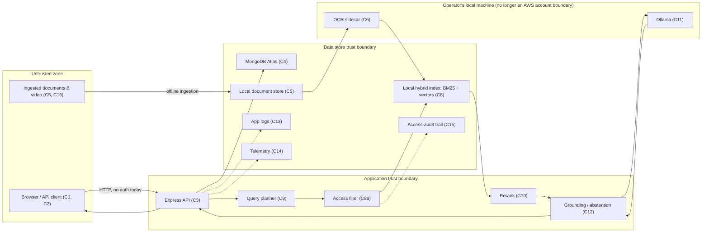

# TennisExplore V2 — Data Threat Model & Data Classification Controls

**Ticket:** TENISE-43 / E5-20
**Epic:** Epic 5 — Security, Privacy & Governance
**Status:** Draft v0.2 — under active development

**Change log**
- **v0.2 (2026-08-18):** the AWS pipeline this document originally described (OpenSearch, Bedrock Agents/Rerank/KB, Nova Pro, CloudTrail) was dropped by the team on 2026-07-30 (no AWS account access — TENISE-40) in favour of a local stack. §3 and §5 are updated to describe what is actually implemented now, not what Epics 2–5 originally planned against AWS. E5-17 (access filtering) and E5-19 (audit trail) have real implementations as of this revision; see the updated rows below. This revision does **not** check any §7 Data Gate box — implementation existing is not the same as it being reviewed, tested end-to-end, and signed off.

## 1. Purpose

Identify how data moves through TennisExplore, what security and privacy
threats exist at each stage, and which controls are required, so that the
demonstration never exposes sensitive information or relies on undocumented
security assumptions, and so stakeholders are shown a security model that
scales to a production solution.

## 2. Scope

Per the acceptance criteria this covers: local document storage, ingestion,
document processing, the retrieval index, generation requests, the chat
interface, temporary files and application logs. (Originally written as "S3
storage... OpenSearch, Bedrock requests" — see the change log above for why
those AWS-specific nouns no longer match the implementation; the boundaries
they described still exist, just against different components.)

Three layers exist side by side in this repository today and all are in
scope, because threats introduced in Sprint 1 do not wait for the rest of
the pipeline to be built:

| Layer | State | Source |
|---|---|---|
| Source Registry API (Express + MongoDB Atlas) | **Implemented** (this repo, `src/modules/sources`) | Current code |
| Local hybrid retrieval (BM25 + dense vector store) → access filter → rerank → Ollama generation | **Implemented**, local stack, replaces the AWS pipeline below | `src/modules/retrieval`, `src/modules/chat/services/answer.service.js` |
| Ingestion → OpenSearch → Bedrock Agents → Nova Pro → Guardrails pipeline | **Dropped 2026-07-30** (no AWS account access — TENISE-40); kept here only so the original Epic 2–5 wording is traceable | Jira TENISE-2, TENISE-3, TENISE-4, TENISE-5 |

The initial corpus must contain only synthetic, public, anonymised or
otherwise approved information — see [§7 Data Gate](#7-data-gate-hard-constraint).

## 3. System Inventory & Trust Boundaries

### 3.1 Components

| # | Component | Type | State | Notes |
|---|---|---|---|---|
| C1 | Chat interface (browser client) | Client | **Implemented** (`public/explore.html`) | Untrusted input origin; still no login screen — role is a client-supplied demo parameter (T-01) |
| C2 | Admin/API client (curl, Postman, future UI) | Client | Implemented | Currently **no authentication** on any route |
| C3 | Express API (`src/app.js`, `modules/sources`, `modules/chat`) | Application | Implemented | Public CORS (`cors()` with no origin allow-list) |
| C4 | MongoDB Atlas (`tennis_explore_v2`) | Data store | Implemented | External managed service, holds source registry, telemetry, and (new) access-audit records |
| C5 | Local document store (`data/`, ingested from operator's filesystem) | Data store | **Implemented, replaces S3** | No upload API mounted yet (`upload.middleware.js` still unused) — today's corpus is built offline via `bin/build-index.js`, not uploaded through the app |
| C6 | Local OCR sidecar (`tools/ocr/ocr_scanned.py`) | Processing | **Implemented, replaces Textract** | Python tool, run offline; output cached to `data/ocr-cache/`, read back by `extraction.service.js` |
| C7 | Chunking/embedding (`ingestion/chunking.service.js`, `embedding.service.js`, via Ollama) | Processing | **Implemented, replaces Bedrock Knowledge Bases** | Writes to the local index, not OpenSearch |
| C8 | Local hybrid index — BM25 (`retrieval/bm25.service.js`) + sharded int8 vector store (`infrastructure/vector/vectorStore.service.js`) | Data store (vector + keyword index) | **Implemented, replaces OpenSearch Serverless** | Carries `acl_groups` on every chunk from first write (TENISE-15); this is the ACL field E5-17 needed to exist before reindexing became expensive, and it does |
| C8a | Access filter (`retrieval/accessControl.service.js`, `shared/constants/accessControl.js`) | Control plane | **Implemented (E5-17)** | Applied *inside* both the BM25 and dense arms, before fusion — the pre-retrieval enforcement point this document called for in v0.1. `assertAccessInvariant` re-checks after fusion as a second line of defence. See §5 T-01/T-02. |
| C9 | Query planner / intent routing (`modules/query/queryPlanner.service.js`) | Processing | **Implemented, replaces Bedrock Agents routing** | Decides statistics (structured table) vs. document route |
| C10 | Rerank (`retrieval/ranking.service.js`, batched LLM scoring via `tools/rerank/rerank_server.py` or Ollama) | Processing | **Implemented, replaces Bedrock Rerank** | Degrades to unreranked fused order (with a stated reason) if the rerank service is unavailable, rather than failing the request |
| C11 | Ollama (local LLM, `llama3.1:8b` by default) | External-to-app model, but **runs on the operator's machine, not AWS** | **Implemented, replaces Amazon Nova Pro** | Receives assembled evidence + prompt; video-frame generation was never implemented, so that sub-threat no longer applies |
| C12 | Grounding/abstention layer (`retrieval/answerContract.service.js`, `generation/verifier.service.js`) | Control plane | **Partially implemented, replaces Bedrock Guardrails** | Covers "refuse when evidence is insufficient" (contextual grounding). Does **not** cover prompt-injection detection specifically — no adversarial-document defence or test exists yet (T-03, Test B still open) |
| C13 | Application logs / console output | Data store | Implemented | `errorHandler.js` still does `console.error(error)` — full error object, unfiltered; unchanged since v0.1 (T-04 gap) |
| C14 | Telemetry store (`modules/telemetry`) | Data store | **Implemented** (TENISE-26/30) | Per-stage records; deliberately content-free (`sanitizeAttributeValue` strips objects, truncates strings) |
| C15 | Access-audit trail (`modules/audit`, Mongo collection `access_audit_records`) | Audit | **Implemented (E5-19), replaces AWS CloudTrail** | Who (role) accessed which document/table, when; one row per document per request, deliberate 400-day retention. Identity is still role-level, not per-account — see the open question in §8 |
| C16 | Temporary files (multer upload buffer/disk) | Data store (transient) | Wired but unused (`upload.middleware.js` present, no route mounts it yet) | Unchanged since v0.1 — needs explicit cleanup policy once wired |
| C17 | `.env` / environment configuration | Secrets | Implemented | Holds `MONGODB_URI` with embedded DB credentials; gitignored |

### 3.2 Trust boundaries

**Key boundary crossings that matter for threats:**

1. **Client → API (T1 boundary):** currently unauthenticated — anyone who
   can reach the port can read, create or archive sources, and can claim
   any role via a request body field. Unchanged since v0.1.
2. **API/Plan → Ollama (local model):** document content leaves the
   retrieval layer and reaches the generation step. This no longer crosses
   an AWS account boundary (Ollama runs on the operator's own machine), but
   the trust question is unchanged: prompt injection embedded in an
   ingested document still crosses this boundary as instructions, not just
   data, and nothing here defends against that specifically yet (T-03).
3. **Access filter → Rerank (C8a → C10):** this is the pre-retrieval
   access-control enforcement point required by Epic 5, now implemented —
   filtering runs inside both the BM25 and dense arms before fusion, so a
   restricted chunk is never assembled into a ranked list in the first
   place. Filtering in the UI afterward would not be real access control,
   because the content would already have reached the model by then.
4. **Access filter → Access-audit trail (C8a -.-> C15):** every grant and
   denial is now recorded (E5-19) — this is the negative-proof mechanism
   Test A needs: an audit row that never contains a given document, for a
   given role, over a given window.
5. **API/Plan → Logs/Telemetry:** anything logged here persists outside
   the data classification the source was assigned (e.g. a sensitive query
   string ending up in a plaintext log). Telemetry (C14) is deliberately
   content-free; application logs (C13) are not (T-04, unchanged since
   v0.1).

## 4. Data Classification Scheme

| Tier | Definition | Criteria | Examples in this system |
|---|---|---|---|
| **Public** | Freely shareable, already public before entering the system | No restriction on redistribution; no attribution to an identifiable individual required | Published ranking data, public conference talks, research papers |
| **Internal** | Not secret, but not meant for external distribution | Produced or held by the team for internal coaching/demo use; disclosure would cause minor embarrassment or confusion, not harm | Internal coaching notes, draft match reports, demo corpus manifests |
| **Sensitive** | Disclosure could cause reputational, competitive or contractual harm | Tied to a specific team/organisation's competitive advantage, or covered by a data-sharing agreement | Unpublished scouting reports, coach interview transcripts, opponent analysis |
| **Personal** | Identifies or can reasonably identify a natural person | Contains name, contact detail, or another identifier that is linkable to one individual, per privacy-law definitions of PII | Athlete names tied to performance stats, player contact info, session participant identity |
| **Biometric** | Derived from an individual's physical/behavioural characteristics | Data captured from body, motion or physiological signal, usable to identify or profile a specific person | Video frames showing an identifiable stroke sequence/face, any future motion-capture or physiological data |

Ordering is cumulative for risk purposes: `Public < Internal < Sensitive <
Personal < Biometric`. A document containing any Personal or Biometric
element is classified at that level even if the rest of the document is
Public.

### 4.1 Data inventory (current + planned) mapped to classification

| Data | Where it lives | Classification | Why |
|---|---|---|---|
| Source registry metadata (title, description, sourceType) | MongoDB (C4) | Internal | Team-authored catalog entries, no PII by design today |
| Ingested research papers, ranking data (published) | Local store → local index (C5, C8) | Public | Already public before ingestion |
| Coach interviews, internal notes, scouting/match reports | Local store → local index (C5, C8) | Sensitive (may contain Personal) | Competitive value; may name athletes |
| Video clips with identifiable stroke sequences | Local store → Ollama (C5, C11) | Biometric | Directly identifies a person via motion/appearance. Not currently ingested — no video path exists in the implemented pipeline |
| Chat queries and generated answers | API ↔ query planner ↔ Ollama (C3, C9, C11) | Inherits the classification of the evidence cited | An answer citing a Sensitive source is itself Sensitive |
| Access-audit records (role, document/chunk id, classification tags — never chunk text) | C15 | Internal | Same content-free rule as telemetry; identifiers and classification tags only |
| Application error logs | Console / C13 | Currently unclassified — **gap, unchanged since v0.1** | `console.error(error)` may capture request bodies/stack traces containing any of the above |
| `.env` credentials (Mongo URI) | Local `.env`, gitignored | Sensitive (secret) | Full database access if leaked |
| Telemetry records | C14 | Internal (must stay content-free) | Must record metadata (counts, latency) not raw content — see T-04 |

## 5. Threat Register

Risk = Likelihood × Impact, rated Low / Medium / High. Every **High**
risk carries a mandatory mitigation and is recorded as a **blocker** to
handling any real (non-synthetic) data, per §7.

| ID | Category | Threat | Affected component(s) | Likelihood | Impact | Risk | Mitigation | Owner | Status |
|---|---|---|---|---|---|---|---|---|---|
| T-01 | Unauthorised data access | No *authentication* exists on the API today — any client can read, create or archive any source, and can claim any of the 8 roles via a request body field (`role`) with no session behind it | C2, C3 | High | High | **High** | **Role-based access filtering is implemented (E5-17)** — the app-level half of this threat is closed: a claimed role really does restrict what evidence a query can retrieve, enforced at C8a before ranking, not in the UI. What remains open is *authentication* — proving the caller is who they claim, so a role cannot simply be self-selected. Add session/token auth before any non-synthetic data is loaded | E5-17 owner | **Open — blocker (authentication only; access filtering itself is done)** |
| T-02 | Cross-user data leakage | Retrieval returns chunks the requesting role should not see, because ACL filtering happens after retrieval instead of before | C8, C8a, C9 | Low (mitigated) | High | Medium (was High) | **Closed in code**: `acl_groups` is written on every chunk at index time (schema v2, TENISE-15), and `buildAccessFilter`/`isPermitted` filter inside both the BM25 and dense arms before fusion, re-verified by `assertAccessInvariant` after. Unit-tested (`test/unit/accessControl.test.js`, `test/unit/vectorStore.test.js` — "applies the access filter before scoring, not after"). Residual risk is entirely T-01's: filtering is only as trustworthy as the role it's given | E5-17 owner | **Mitigated — Test A now partially runnable, see §6** |
| T-03 | Prompt injection via ingested documents | Instructions embedded in an ingested PDF/DOCX/transcript attempt to override system behaviour once ingested and later cited as evidence | C5, C6, C9, C11 | Medium | High | **High** | Grounding/abstention (C12, `answerContract.service.js`/`verifier.service.js`) refuses when the model's answer isn't supported by evidence — a partial, incidental defence. No purpose-built prompt-injection defence exists: the prompt template does not explicitly instruct the model to treat evidence as data-not-instructions, and no adversarial-document test exists (Test B) | E4/E5 owners | **Open — blocker, unchanged since v0.1** |
| T-04 | Sensitive data in prompts/responses/logs | A Sensitive/Personal/Biometric source is quoted verbatim in a generated answer, or the request/response pair is written to logs or telemetry unredacted | C11, C13, C14 | Medium | High | **High** | Citation binding references chunk IDs, not forced verbatim reproduction. Telemetry (TENISE-26) is confirmed content-free (`sanitizeAttributeValue` strips objects, truncates strings). **New**: the access-audit trail (E5-19, C15) stores only identifiers and classification tags, never chunk text, by the same rule. What is still open: `errorHandler.js` still does `console.error(error)` unfiltered — the one place in the codebase that violates this threat's own mitigation | Telemetry + logging owners | **Open — blocker (application logs only; telemetry and audit trail are compliant)** |
| T-05 | Credential exposure | Secrets (Mongo URI) committed to git, printed to logs, or shared in chat/tickets in plaintext | C17, C13 | Medium | High | **High** | `.env` stays gitignored (already true); never echo full connection strings in logs or commit messages; rotate any credential that was pasted into a non-secret channel | Whole team | **Open — blocker** (see note below) |
| T-06 | Malicious or corrupt uploads | A corrupt or crafted file (e.g. the deliberately corrupt PDF in TENISE-34's test corpus, or a zip bomb / oversized file) disrupts ingestion or is used as an attack vector | C5, C6, C16 | Medium | Medium | Medium | Ingestion pipeline must isolate per-file failures (already an acceptance criterion of TENISE-11) and cap file size/type at upload; multer middleware (`upload.middleware.js`) needs size/type limits wired before it is mounted — still not mounted on any route | TENISE-11 owner | Open, unchanged since v0.1 |
| T-07 | Incomplete data deletion | Archiving a source (`archiveSource`) only sets `isActive: false` — the document and its underlying chunks/embeddings/log traces are not actually erased | C4, C8, C13, C14, C15 | High (already true today) | Medium | Medium | Define and document a real deletion/retention path before real data is loaded: what "delete" means across Mongo, the local index, logs, telemetry, and now the audit trail too (audit retention is deliberately long, 400 days — see `audit.config.js` — which makes this more not less important to define) | Data owner (TBD) | Open, unchanged since v0.1 |
| T-08 | Unrestricted cross-origin access | `app.use(cors())` allows any origin with no allow-list, widening who can call the API from a browser context once C2 is not the only client | C3 | Low today (no auth yet makes this secondary), rises once auth exists | Medium | Low–Medium | Restrict CORS to known origins once a real frontend exists; revisit alongside T-01's authentication gap | E5-17 owner | Open, unchanged since v0.1 |

**Note on T-05:** a real MongoDB Atlas connection string (including
password) was shared in this chat session on 2026-07-28 to unblock local
development. It is stored only in the gitignored `.env` file, but per this
threat's own mitigation it should be **rotated** once no longer needed for
active development, since it passed through a non-secret channel.

## 6. Required Tests (per acceptance criteria)

| Test | Verifies | Depends on | Status |
|---|---|---|---|
| **Test A** — a role without access to a restricted document cannot retrieve it through the chat interface, even indirectly via citation | T-01, T-02 | E5-17 (access-control implementation), E3-09 (ACL field in schema) | **Partially runnable now.** The filter itself is unit-tested at both layers (`accessControl.test.js` proves the analyst role is denied physiological data; `vectorStore.test.js` proves the filter runs before scoring, not after), and every denial is now written to the access-audit trail (E5-19) with zero documents attached — the negative-proof record this test needs. What is **not** yet proven end-to-end is "through the chat interface": there is no integration test that drives a real HTTP request with a restricted role and asserts on the response + audit trail together, and role is still self-declared (T-01's open half), so this cannot be called *closed* |
| **Test B** — a document containing embedded instructions ("ignore previous instructions...") cannot change system behaviour when ingested and cited | T-03 | E4-16 (prompt template), E5-18 (Guardrails) | Not runnable yet — no prompt-injection-specific defence exists to test (T-03 unchanged) |
| **Test C** — application logs and telemetry records, inspected after a full test run, contain no Personal/Biometric/Sensitive content | T-04 | TENISE-26 (telemetry structure), logging conventions | **Mostly runnable now.** Telemetry (C14) and the access-audit trail (C15) are both content-free by construction and unit-tested for it (`accessAuditRecorder.test.js` asserts chunk text is dropped). `errorHandler.js`'s unfiltered `console.error(error)` remains the one confirmed failure |

Test plans for B should stay written-but-not-runnable (even though it can't
run until T-03's dependencies land) so the acceptance bar is defined before
the code exists, consistent with the "build instrumentation before there is
much to measure" principle already used in TENISE-26. Test A's remaining
gap (end-to-end, through real auth) should be written as an integration
test once session/token auth lands for T-01.

## 7. Data Gate (hard constraint)

> No real, identifiable athlete information may be uploaded, indexed, sent
> to an AI model, or included in logs until **all** of the following are
> confirmed:

- [ ] Data classification scheme reviewed and accepted (§4)
- [ ] Access controls implemented and tested (T-01, T-02 closed — Test A passes) — **T-02 mitigated, T-01 still open on authentication; Test A partially runnable, not end-to-end. Closer than v0.1 but not there.**
- [ ] Retention/deletion requirements defined (T-07 closed)
- [ ] Project owner authorisation recorded

Until every box is checked, the corpus (TENISE-34) must remain synthetic,
public, or anonymised, which matches TENISE-34's own acceptance criteria.
This document is the tracking point for that gate — do not check a box
here without linking the Jira ticket that closed it. (v0.2 note: E5-17 and
E5-19 both have real implementations now, but "implemented" is not this
gate's bar — nothing above is checked yet, and shouldn't be until T-01's
authentication gap closes and someone actually signs off.)

## 8. Open Questions / Assumptions

1. ~~**Vector store mismatch**~~ — **Resolved (2026-08-18), differently than either option this document previously named.** Neither Qdrant nor OpenSearch: the team dropped AWS entirely (TENISE-40, 2026-07-30) and the implemented retrieval index is a custom local store — sharded, int8-quantised vectors (`infrastructure/vector/vectorStore.service.js`) plus a separate BM25 keyword index (`retrieval/bm25.service.js`), combined by reciprocal rank fusion. `qdrant.client.js` is still an empty, unreferenced stub and should still be deleted — it describes neither the old plan nor the current implementation.
2. **Temporary file handling:** `upload.middleware.js` exists but is not
   mounted on any route yet. Unchanged since v0.1. Somewhat lower priority
   now that ingestion in practice runs offline via `bin/build-index.js`
   against a local filesystem path, not through an upload endpoint — but
   the acceptance criteria still call for one, so this remains open.
3. **Auth mechanism choice — still open.** The role model itself is no
   longer in question (§3.1 C8a, 8 roles, `accessControl.js`), but *how a
   caller proves which role they are* still is: session vs. token, and
   where the identity comes from at all, since there is no user account
   concept anywhere in the codebase today (confirmed by grep — no
   `req.user`, no login route). This is the one piece of T-01 still open,
   and it blocks Test A from being called end-to-end, not just
   unit-level.

## 9. Definition of Done (mirrors ticket acceptance criteria)

- [x] All components, data stores, external services and trust boundaries identified (§3) — updated v0.2 for the local stack
- [x] All data types classified with criteria (§4)
- [x] Threat register covering all eight required categories (§5)
- [x] Each threat records likelihood, impact, mitigation, owner, status (§5)
- [x] Every High-risk threat has a mitigation strategy and is recorded as a blocker (§5, T-01–T-05)
- [ ] Test A, B, C pass against a running system (§6) — **Test A and C now partially runnable** (E5-17, E5-19 implemented); both still short of "pass end-to-end against a running system" — Test A needs real authentication (T-01), Test C needs the `errorHandler.js` fix. Test B still blocked on E4-16/E5-18, neither of which exist yet
